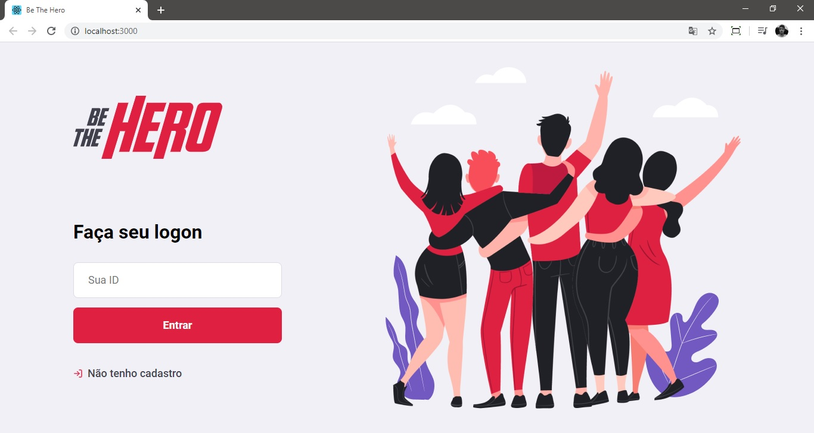
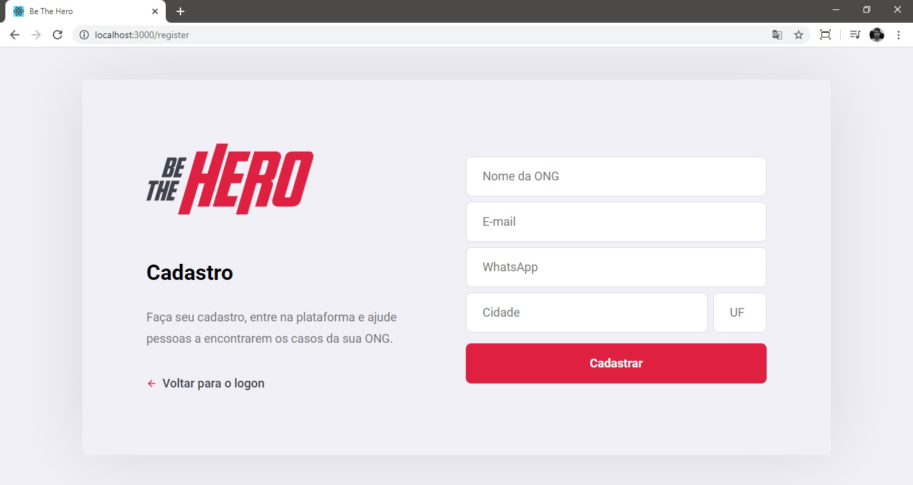
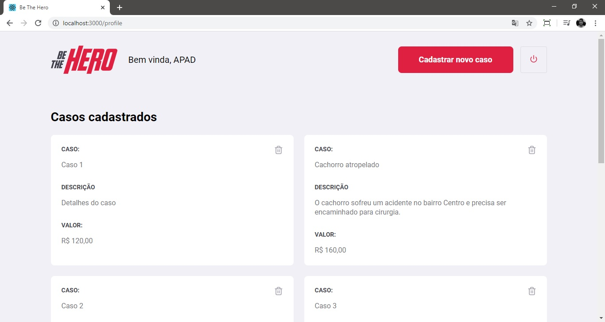
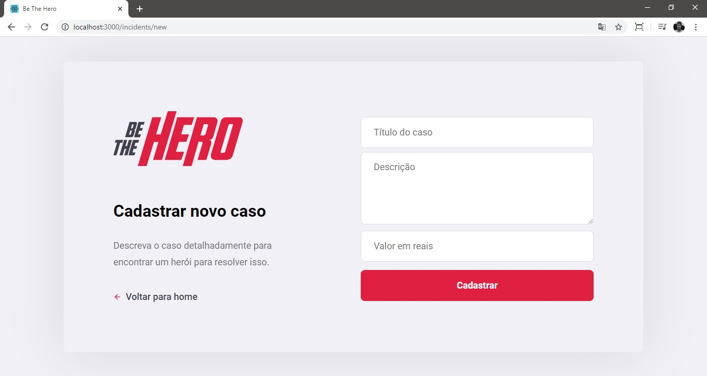
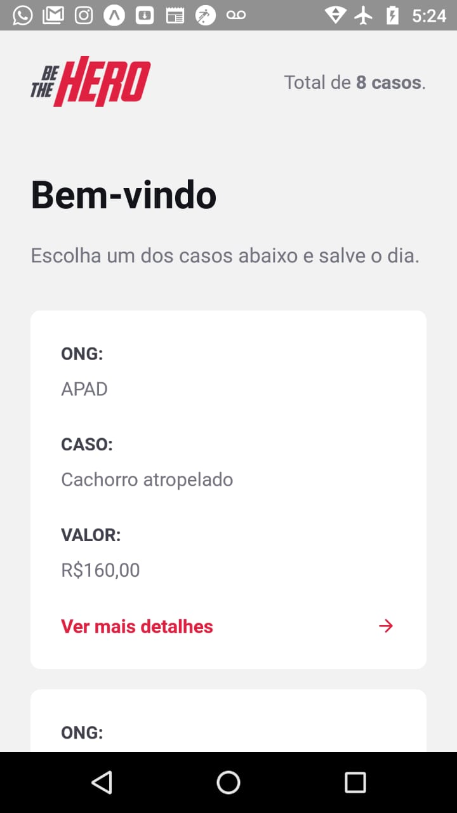
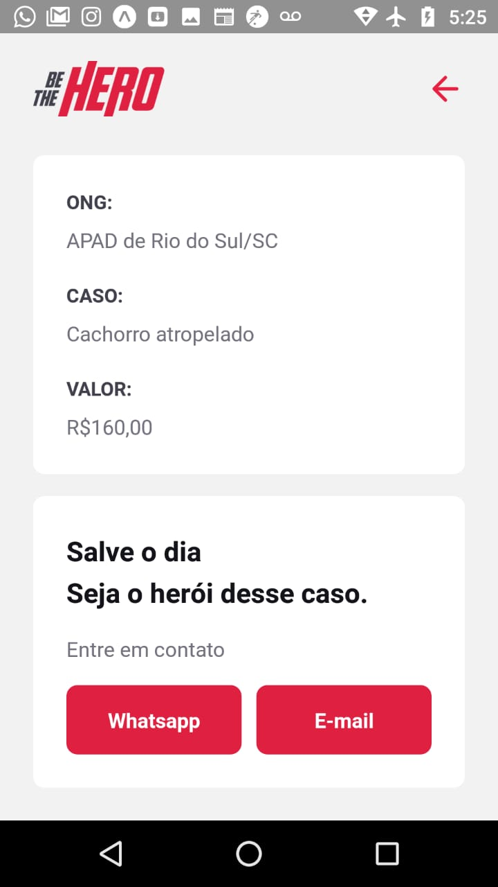

<h1
    align="center"
    style="color: #E02041;"
>
    ❤ Be The Hero: Para ser um herói, basta solidariedade🥰
</h1>

<h3
    align="center"
    style="color: #CF1940"
>
    Cadastre sua ONG e e receba voluntários, ou então seja o herói de uma delas
</h3

Desenvolvido durante a Semana OmniStack 11 (evento realizado pela Rocketseat), o BeTheHero é uma aplicação que permite ao usuário cadastrar os dados de contato de sua ONG, bem como buscar dados de outras ONGs que ele deseja ajudar.

<h4>🛠 Tecnologias e ferramentas: 🛠</h4>
<ul>
    <li>Node.JS e Knex</li>
    <li>ReactJS</li>
    <li>React Native</li>
    <li>Expo CLI</li>
</ul>

<h4>📑 Recursos adicionais: ⌨</h4>
<ul>
    <li>Validações no backend com <b>Celebrate</b></li>
    <li>Testes de integração automatizados com <b>Jest</b></li>
</ul>

<h4>📷 Capturas de tela: 📷</h4>
<table>
    <tr><td align="center"><strong>Aplicação web</strong></td></tr>
    <tr>
        <td>
            
        </td>
    </tr>
    <tr>
        <td>
            
        </td>
    </tr>
    <tr>
        <td>
            
        </td>
    </tr>
    <tr>
        <td>
            
        </td>
    </tr>
</table>

<table>
    <tr><td colspan="2" align="center"><strong>Aplicação mobile</strong></td></tr>
    <tr>
        <td>
            
        </td>
        <td>
            
        </td>
    </tr>
</table>

